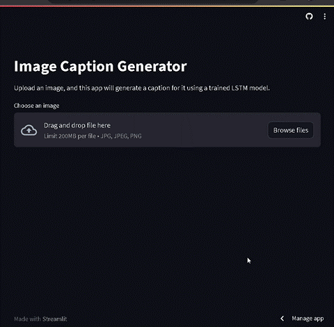

# Image Caption Generation using Deep Learning

## Overview

This repository contains code for an image caption generation system using deep learning techniques. The system leverages a pretrained VGG16 model for feature extraction and a custom captioning model which was trained using LSTM for generating captions. The model is trained on the Flickr8k dataset using an attention mechanism to improve caption quality.

The key components of the project include:

- Image feature extraction using a pretrained VGG16 model (Consider using MobileNetV2 for memory efficiency)
- Caption preprocessing and tokenization
- Custom captioning model architecture with attention mechanism
- Model training and evaluation
- Streamlit app for interactive caption generation

## About the Dataset

The [Flickr8k dataset](https://www.kaggle.com/adityajn105/flickr8k) is used for training and evaluating the image captioning system. It consists of 8,091 images, each with five captions describing the content of the image. The dataset provides a diverse set of images with multiple captions per image, making it suitable for training caption generation models.

## Future Scope

1. **Fine-tuning**: Experiment with fine-tuning the captioning model architecture and hyperparameters for improved performance.
2. **Dataset Expansion**: Incorporate additional datasets to increase the diversity and complexity of the trained model for example we can train the model on [Flickr30k dataset](https://www.kaggle.com/datasets/hsankesara/flickr-image-dataset).
3. **Beam Search**: Implement beam search decoding for generating multiple captions and selecting the best one.
4. **User Interface Enhancements**: Improve the Streamlit app's user interface and add features such as image previews and caption confidence scores.
5. **Multilingual Captioning**: Extend the model to generate captions in multiple languages by incorporating multilingual datasets.
